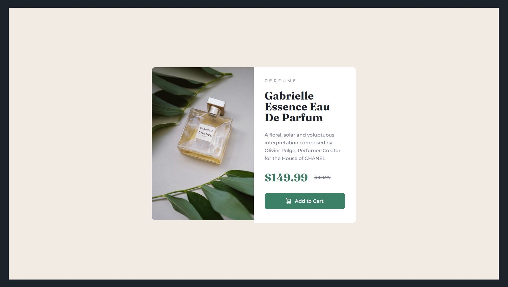

# Frontend Mentor - Product preview card component solution

This is a solution to the [Product preview card component challenge on Frontend Mentor](https://www.frontendmentor.io/challenges/product-preview-card-component-GO7UmttRfa). Frontend Mentor challenges help you improve your coding skills by building realistic projects.

## Table of contents

- [Overview](#overview)
  - [The challenge](#the-challenge)
  - [Screenshot](#screenshot)
  - [Links](#links)
- [My process](#my-process)
  - [Built with](#built-with)
  - [What I learned](#what-i-learned)
- [Author](#author)

## Overview

### The challenge

Users should be able to:

- View the optimal layout depending on their device's screen size
- See hover and focus states for interactive elements

### Screenshot

### Links

- Solution URL: [https://github.com/sjohnston82/product-preview-card](https://github.com/sjohnston82/product-preview-card)
- Live Site URL: [https://cool-custard-e37762.netlify.app/](https://cool-custard-e37762.netlify.app/)

## My process

### Built with

-HTML
-CSS

### What I learned

This was probably the easiest FEM project I've come across so far, there wasn't much to it, but it is always good to get a refresher in with vanilla HTML and CSS after using things like tailwind for a while.

## Author

- Website - [Stephen Johnston](https://www.stephenmjohnston.net)
- Frontend Mentor - [@sjohnston82](https://www.frontendmentor.io/profile/sjohnston82)
